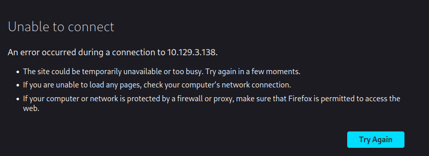
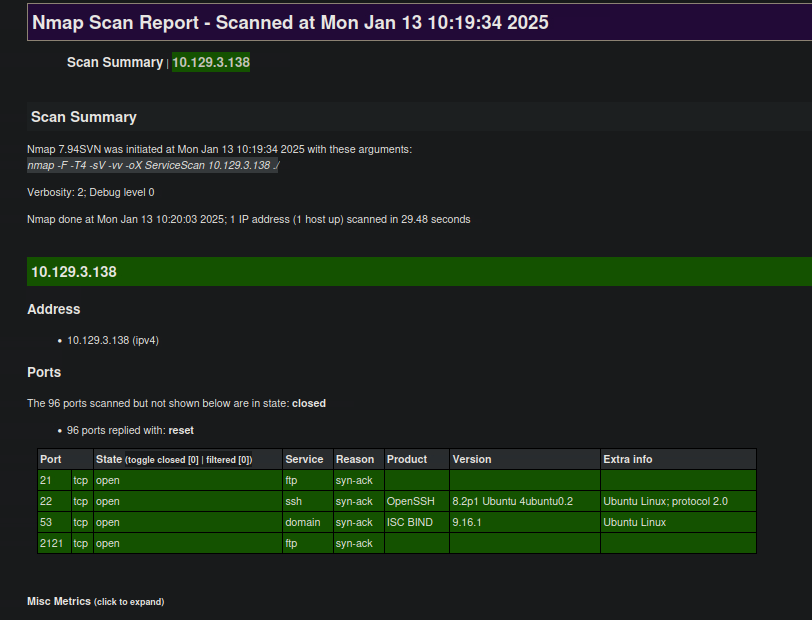
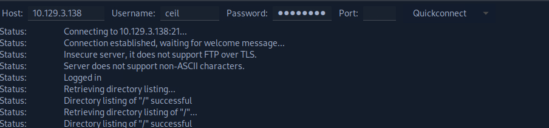
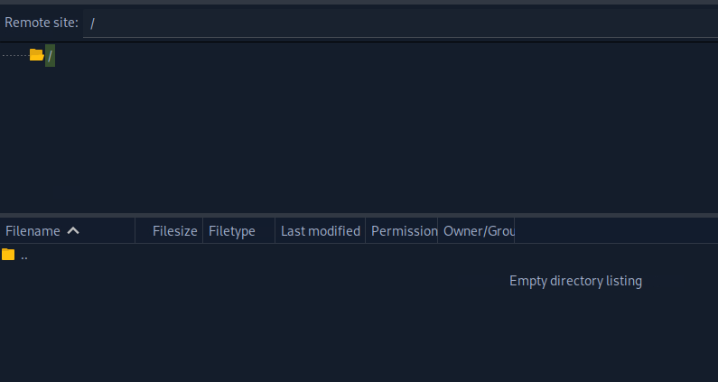
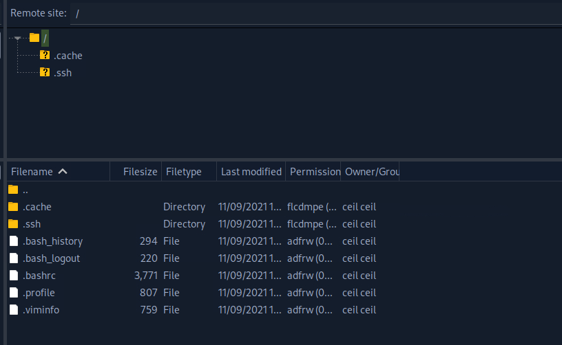
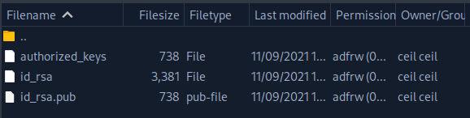

# Enumerate the server carefully and find the flag.txt file. Submit the contents of this file as the answer.

We were commissioned by the company Inlanefreight Ltd to test three different servers in their internal network. The company uses many different services, and the IT security department felt that a penetration test was necessary to gain insight into their overall security posture.

The first server is an internal DNS server that needs to be investigated. In particular, our client wants to know what information we can get out of these services and how this information could be used against its infrastructure. Our goal is to gather as much information as possible about the server and find ways to use that information against the company. However, our client has made it clear that it is forbidden to attack the services aggressively using exploits, as these services are in production.

Additionally, our teammates have found the following credentials "ceil:qwer1234", and they pointed out that some of the company's employees were talking about SSH keys on a forum.

The administrators have stored a flag.txt file on this server to track our progress and measure success. Fully enumerate the target and submit the contents of this file as proof.

---

Ping the target to be sure is up and running

`ping -c 4 10.129.3.138`

Output: 

````
PING 10.129.3.138 (10.129.3.138) 56(84) bytes of data.
64 bytes from 10.129.3.138: icmp_seq=1 ttl=63 time=65.7 ms
64 bytes from 10.129.3.138: icmp_seq=2 ttl=63 time=65.4 ms
64 bytes from 10.129.3.138: icmp_seq=3 ttl=63 time=65.8 ms
64 bytes from 10.129.3.138: icmp_seq=4 ttl=63 time=65.6 ms
````

TTl is 63 so is probably a Linux machine. Let's continue. 

We can't see anything on Firefox. 



### Let's start with nmap

`sudo nmap -F -T4 -sV -vv 10.129.3.138`

-F to scan the most used ports. T4 to accelerate the process (we don't care to be silent here), -sV for services and versions. -vv for double verbose. -oX to have an output on .xml file and then conver it on .html

`xsltproc ServiceScan -o ServiceScan.html`

Now let's open the html. 

`firefox ServiceScan.html`



We have 4 services. 2 of them are ftp, on port 21 and 2121. We have an ssh on port 22 and dns service on 53. 

Let's try to login on the ssh service with the credentials ceil:qwer1234

`ssh ceil@10.129.3.138 -p 22`

output:

````
The authenticity of host '10.129.3.138 (10.129.3.138)' can't be established.
ED25519 key fingerprint is SHA256:AtNYHXCA7dVpi58LB+uuPe9xvc2lJwA6y7q82kZoBNM.
This key is not known by any other names.
Are you sure you want to continue connecting (yes/no/[fingerprint])? yes
Warning: Permanently added '10.129.3.138' (ED25519) to the list of known hosts.
ceil@10.129.3.138: Permission denied (publickey).
````

Ok, that didn't work. Maybe we have a ssh key on the ftps. Let's try there. 

`sudo apt install filezilla` (only if you don't have it installed.)

`filezilla`

It looks like there is nothing inside. 




Let's try on the port 2121



Ok, now we are talking. We have a .ssh 



Let's copy those inside my machine. And then connect 

*drag and drop .ftp ssh files inside my machine*

`ssh -i id_rsa -p 22 ceil@10.129.3.138`

output:
````
@@@@@@@@@@@@@@@@@@@@@@@@@@@@@@@@@@@@@@@@@@@@@@@@@@@@@@@@@@@
@         WARNING: UNPROTECTED PRIVATE KEY FILE!          @
@@@@@@@@@@@@@@@@@@@@@@@@@@@@@@@@@@@@@@@@@@@@@@@@@@@@@@@@@@@
Permissions 0644 for 'authorized_keys' are too open.
It is required that your private key files are NOT accessible by others.
This private key will be ignored.
Load key "authorized_keys": bad permissions
ceil@10.129.3.138: Permission denied (publickey).
````

The error you are seeing indicates that the permissions of your id_rsa file are too open, which is a security risk. SSH requires private key files to have more restrictive permissions to ensure that only the file's owner can access it.

You can fix this by changing the permissions of your id_rsa file with the following command:

`chmod 600 /path/to/your/id_rsa`

And here we go again

`ssh -i id_rsa -p 22 ceil@10.129.3.138`

Ok we are in! Let's search for a flag.txt file shall we? 

`find / -name flag.txt 2>/dev/null`

`/` searches from the root directory, but you can replace it with a specific directory if you want to search within a smaller scope.
`-name flag.txt` specifies that you're searching for a file named flag.txt.
`2>/dev/null` suppresses error messages related to directories you don't have permission to access.

output:
`/home/flag/flag.txt`

There you are! 

`cat /home/flag/flag.txt`

output:
`HTB{7nrzise7he`etc...

Let's do something to hide our steps 😈

`history -c`
`rm ~/.bash_history`

END